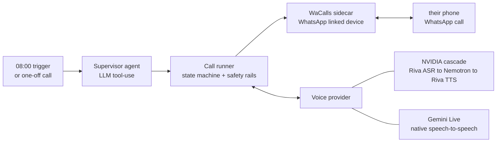

# Svara.ai — an open-source AI voice agent that makes real WhatsApp calls

**Svara.ai places a real WhatsApp voice call, listens, and holds a natural spoken conversation in English, Hindi or Hinglish.** No browser, no virtual audio cable, no telephony provider and no phone number to buy: it speaks the WhatsApp VoIP protocol directly as a linked device. It was built to call someone at 08:00 and keep talking until they were genuinely awake, and the same engine now runs reminder calls, check-ins and any call with a custom objective.

*Svara* (स्वर) is Sanskrit for tone, pitch, voice — the sound a thing makes when it speaks.

[](LICENSE)
[](https://www.python.org/)
[](tests/)
[](#contributing)



## What it actually does

- **Real calls, real audio.** WhatsApp VoIP through [WaCallsNative](https://github.com/jobasfernandes/WaCallsNative) (Go), with raw 16 kHz PCM over a loopback WebRTC data channel. Nothing is automated in a browser and no audio is routed through your speakers.
- **Two interchangeable voice brains.** An NVIDIA cascade (Parakeet streaming ASR → Nemotron-3-super → Magpie TTS) or Gemini Live native speech-to-speech, behind one `RealtimeVoiceProvider` interface. Swap with `--live`; the call logic never knows the difference.
- **It gets interrupted like a person.** Barge-in cancels the reply mid-sentence, the outbound pacer keeps WhatsApp's jitter buffer happy, and the context keeps only what the other person actually heard.
- **Bilingual.** English, Hindi and Hinglish, with speech recognition pinned to a language set so a noisy "haan" is never mistaken for Italian.
- **Safety rails in code, not in the prompt.** It discloses that it is an AI, never claims to be its owner, never retries a declined call, stops on "stop calling" / "band karo", caps attempts and call length, and always hangs up.
- **Runs unattended.** LaunchAgents on a Mac, or `docker compose` on a VPS. Also exposed to Claude Code and other agents as an MCP server.

## Use cases

One engine, one interface, many jobs — the objective is just a string:

| | |
|---|---|
| **Wake-up calls** | keeps talking until it has evidence you're actually awake, then calls back to check |
| **Medication and appointment reminders** | a spoken call lands where a push notification does not |
| **Elderly and family check-ins** | a short daily "how are you doing" with a summary sent back to you |
| **Lead qualification and follow-up** | ask three questions, hear the answers, write the summary |
| **Delivery and booking confirmations** | confirm, reschedule, or mark unreachable |
| **Standups and on-call escalation** | call the human when a page goes unacknowledged |
| **Voice surveys and NPS** | one question, an open-ended spoken answer, a transcript |

## Quickstart

```bash
git clone https://github.com/namanchitkara2/svara-ai && cd svara-ai
uv sync && ./services/wacalls/build.sh
cp .env.example .env                                 # add your own API keys here; .env is gitignored
cp config/wake.example.yaml config/wake.yaml         # who to call, when, in which language

./deploy/macos/install.sh && uv run svara pair       # pair as a WhatsApp linked device
uv run python scripts/simulate_call.py all           # rehearse against simulated people first
uv run svara test --contact "+91XXXXXXXXXX" --show-transcript
uv run svara test --contact "+91XXXXXXXXXX" --live --language hi --objective "remind them about the 6pm call"
```

`wake-agent` stays a working alias for `svara`, so existing installs and service files keep running.

**Requirements:** Python 3.12+, [uv](https://docs.astral.sh/uv/), Go (for the WhatsApp sidecar), a spare WhatsApp number to link, and an NVIDIA API key, a Gemini API key, or both. Keys live only in your local `.env` — none are stored in this repo.

## Voice providers

| | NVIDIA cascade | Gemini Live |
|---|---|---|
| How | Riva Parakeet ASR → Nemotron-3-super → Riva Magpie TTS | the model hears the audio and speaks back |
| Turn-taking | client-side endpointing + barge-in detection | the model's own VAD, plus the same barge-in path |
| Latency (India, measured) | ≈1.6–1.9 s English, ≈3.3 s Hindi | lower, and it sounds markedly more human |
| Keys | `NVIDIA_API_KEY` | `GEMINI_API_KEY` |
| Select | default | `--live`, or `voice.provider: gemini_live` |

## Documentation

| Doc | What's in it |
|---|---|
| [docs/architecture.md](docs/architecture.md) | diagrams of every component, exact audio formats at each boundary, the state machine, the safety rails |
| [docs/setup.md](docs/setup.md) | install, pairing, every command, MCP, Docker |
| [docs/research.md](docs/research.md) | the WhatsApp-calling and realtime-voice research behind the design, and what was rejected |
| [docs/troubleshooting.md](docs/troubleshooting.md) | every failure seen on a live call and how it is handled |

## FAQ

**Does this need a Twilio number or any telephony provider?**
No. Calls go over WhatsApp's own VoIP, placed by a linked device, so there is no per-minute carrier cost and the callee sees your WhatsApp identity.

**Does it work without WhatsApp Business API access?**
Yes. The Business API does not offer voice calls of this kind. Svara.ai links to a normal or Business *app* number the same way WhatsApp Web does.

**Which languages are supported?**
English, Hindi and Hinglish are tested end to end. Recognition languages are configurable (`pa-IN`, `ur-IN`, `bn-IN` and others), and the voice is a config value.

**Can the other person interrupt it?**
Yes, that was the hardest part. A genuinely new utterance flushes the outbound audio queue and cancels the reply, and only what was actually heard stays in context.

**Is it a chatbot with text-to-speech bolted on?**
No. It is a streaming duplex audio loop: 60 ms frames in and out, sentence-level TTS, paced playback, and watchdogs on silence, dead audio and call length.

**Does the callee know it's an AI?**
Always. The opening line discloses it, and the agent is forbidden in code from claiming to be its owner. Please get consent before calling anyone, and check the recording and robocall law where you live.

**Can another agent drive it?**
Yes, `apps/mcp_server.py` is an MCP server: `claude mcp add svara -- uv --directory ~/svara-ai run svara-mcp`.

**How much does a call cost?**
Only model inference. There are no carrier or platform fees.

## Status and honest limits

A working prototype. It has completed real calls end to end in English and Hindi, and it passes 26 tests plus 8 simulated-call scenarios.

- **Unofficial client.** WaCallsNative is a reverse-engineered WhatsApp client. The linked number carries a real risk of being banned, and this is very likely against WhatsApp's Terms of Service. Use a number you can afford to lose.
- **Hindi latency** is still around 3.3 s on the cascade; the Live provider is the fix.
- **On a laptop**, the machine has to stay awake and plugged in.
- Consent, recording and robocall law is yours to get right. This is not legal advice.

## Contributing

Issues and pull requests are welcome — especially new `RealtimeVoiceProvider` implementations (OpenAI Realtime, local Whisper + Piper), other `WhatsAppProvider` backends, and language coverage beyond Hindi and English. `uv run pytest` and `uv run python scripts/simulate_call.py all` both have to pass (the simulations run the real stack against invented people: a sleepy housemate, a sales prospect, a feedback call and three friends being invited to a party). If the project is useful to you, a ⭐ helps other people find it.

## License

[MIT](LICENSE) © 2026 Naman Chitkara. Not affiliated with, endorsed by, or connected to WhatsApp, Meta, NVIDIA or Google.

---

<sub>**Topics:** ai voice agent · whatsapp voice call automation · speech-to-speech AI · realtime voice AI · conversational AI phone calls · NVIDIA Riva ASR TTS · Nemotron · Gemini Live API · Hindi voice assistant · AI wake-up call · automated reminder calls · Python asyncio WebRTC · MCP server</sub>
