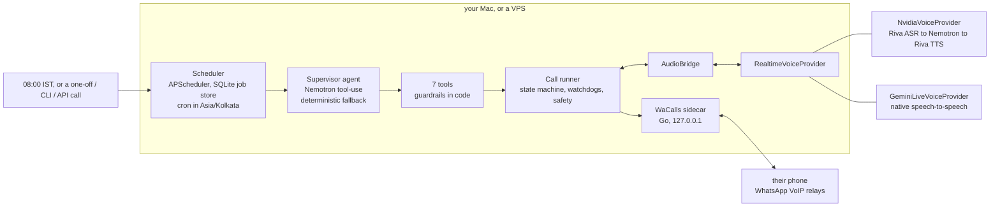
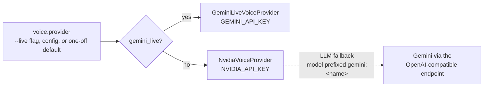
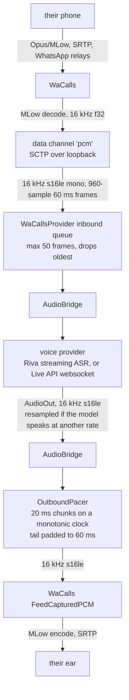
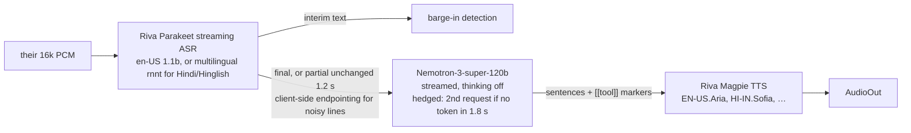
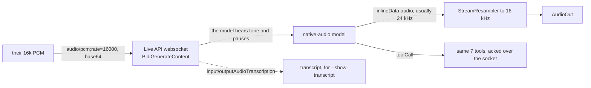
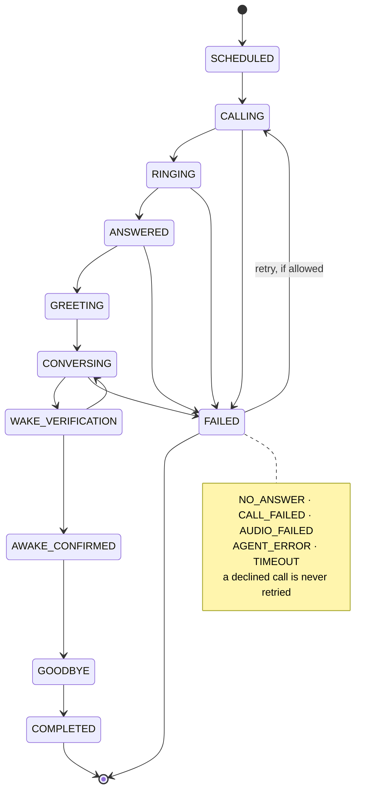

# Svara.ai: Architecture

How an AI agent places a real WhatsApp voice call and holds a spoken conversation: the processes, the exact audio format at every boundary, the state machine, and the safety rails that are enforced in code rather than in a prompt.

## 1. The big picture



Three processes, all local:

| Process | What | Listens on |
|---|---|---|
| `wacalls` | WaCallsNative (Go): WhatsApp linked device, call signalling, MLow codec, SRTP relays | `127.0.0.1:8787` (bearer token) |
| `svara serve` | Scheduler + local control API + config watcher | `127.0.0.1:8790` (bearer token) |
| a call run | Spawned by the scheduler, CLI or API; places one call and runs the conversation | loopback WebRTC only |

On macOS they run as LaunchAgents (`deploy/macos/install.sh`), with the daemon wrapped in `caffeinate -i -s`. In Docker, the agent shares the `wacalls` network namespace (`docker-compose.yml`), so everything stays loopback. `svara` and `wake-agent` are the same entry point.

## 2. Layers and their contracts

```
apps/        CLI (svara …), daemon, local API + UI, MCP server            ← entry points
agents/      supervisor.py   high-level agent (LLM tool-use + fallback)
             tools.py        the ONLY capabilities: whatsapp_call/_status/_hangup/_get_contact,
                             wake_get_context/_update_state/_finish  + guardrails
             wake_call.py    one call attempt: state machine, watchdogs, verification, goodbye
             state_machine.py, prompts.py
services/    whatsapp/  base.py (WhatsAppProvider) · wacalls.py · sim.py (simulated callee)
             voice/     base.py (RealtimeVoiceProvider) · nvidia.py · gemini_live.py · text.py
             audio/     bridge.py · pacer.py · resample.py
             scheduler.py · store.py (SQLite) · config.py · observability.py
db/          schema.sql
```

Swappable boundaries:

- **`WhatsAppProvider`**: `connect · authenticate · call · get_call_status · wait_status_change · receive_audio · send_audio · flush_audio · hangup`. All WaCalls specifics live in `services/whatsapp/wacalls.py`. `sim.py` implements the same interface with a simulated person.
- **`RealtimeVoiceProvider`**: `connect(instructions, tools) · send_audio · receive() events · say · respond · interrupt · close`. It was shaped like OpenAI Realtime and Gemini Live so that a speech-to-speech model could replace the cascade without touching the call logic — `gemini_live.py` is that prediction paying off: it emits the same events at the same 16 kHz boundary, and `WakeCall`/`AudioBridge` cannot tell which provider is running.

Provider selection happens in one place, `make_voice_factory` in `apps/runtime.py`:



The cascade keeps an ordered list of dialogue models. A model may be prefixed with its provider (`gemini:…`); unprefixed means NVIDIA NIM. `_client_for` routes each request, so a NIM outage degrades to another vendor mid-call instead of dropping the conversation.

## 3. The audio path (exact formats)



- **16 kHz end to end on the NVIDIA path**, with no resampling: Riva ASR and Magpie TTS both run at the WhatsApp rate. `resample.py` (soxr) exists for providers that do not — Gemini Live answers at 24 kHz, and the rate is read off the `mimeType` on every chunk rather than assumed.
- **Pacing is mandatory.** WaCalls encodes and sends each 60 ms frame immediately. TTS arrives in bursts, so without the pacer WhatsApp's jitter buffer would discard most of a sentence.
- **Barge-in**: a *new* utterance (it started after the agent's turn began, ≥6 chars of interim text) while agent audio is queued. The pacer queue is flushed instantly and the turn is cancelled, and the context keeps only what they actually heard. The opening line is never barge-able, because people say "hello?" the moment they pick up.
- **Loopback ICE**: aiortc offers only `127.0.0.1` host candidates. The macOS firewall silently blocks the default ones.

## 4. The conversation engine

### 4a. NVIDIA cascade (default)



Measured (India → NVCF, 2026-09-22): end of their speech → first agent audio ≈ **1.6–1.9 s English**, **≈3.3 s Hindi**.

The voice model acts through in-band markers such as `[[report_wake_evidence {...}]]`, `[[awake_confirmed]]` and `[[end_call {"reason": ...}]]`. These are parsed out of the stream and never spoken, which keeps it to one streamed completion per turn.

### 4b. Gemini Live (native speech-to-speech)



Why it exists: the cascade sounds synthetic and pays three hops of latency. A native-audio model hears tone and pauses, does its own turn-taking, and speaks like a person. Two things had to be forced:

- **Recognition languages are pinned** (`en-IN`, `hi-IN`, `pa-IN` by default, configurable). Left to auto-detect, short noisy replies came back as French or Italian on a live call and the model answered in Italian. A system rule repeats the constraint in words.
- **`silenceDurationMs` 900 with 300 ms prefix padding**, because people trail off mid-sentence and the default VAD answered over them.

The websocket handshake uses the certifi CA bundle; `websockets` does not use httpx's, and macOS fails verification without it.

## 5. The call state machine



Every transition is validated (`IllegalTransition`) and logged as a `STATE` event.

**Safety rails, enforced in code and not by the prompt:**

| Rail | Where |
|---|---|
| Max attempts (default 3, hard cap 5), ≥30 s apart (default 300 s) | `WakeConfig.retry`, `WakeTools.can_call` |
| **Declined call ⇒ never retried** (WaCalls reports a decline as `user_ended` while ringing, normalised) | `WakeCall._run`, `deterministic_should_retry` |
| **"stop calling / mat karo / band karo" ⇒ no more calls**, even if the LLM never emits `end_call` | `STOP_RE` in `wake_call.py` |
| Awake only after ≥ `min_user_turns` of their replies | `_on_tool(awake_confirmed)` |
| `end_call` refused until they are confirmed awake (wake mode) | `_on_tool(end_call)` |
| Ring timeout 70 s; no inbound audio for 10 s after answer ⇒ AUDIO_FAILED; inbound stall 15 s | watchdog |
| Max call length (15 min, hard cap 30) ⇒ goodbye + hangup | watchdog |
| Silence ⇒ nudge after N s | watchdog |
| Model down ⇒ canned lines; 4 consecutive failures ⇒ hangup | `_on_provider_error` |
| Always hang up (`finally`) | `WakeCall._cleanup` |
| One run per day: `UNIQUE(fire_key='schedule:YYYY-MM-DD')` | `db/schema.sql` |
| Discloses it is an AI, never claims to be its owner, never invents facts | `agents/prompts.py` |

## 6. The high-level agent

`WakeSupervisor` is an LLM tool-use loop (Nemotron, OpenAI-compatible function calling) with exactly the seven tools in `agents/tools.py`. There is no shell and no filesystem access. It decides whether to call again after each attempt and writes the summary. If the LLM errors, stalls, or fails to dial, the **deterministic policy** takes over, so the 08:00 call never depends on the supervisor LLM being up.

The same capabilities are exposed to Claude Code and other MCP clients through `apps/mcp_server.py` (stdio MCP):
`claude mcp add svara -- uv --directory ~/svara-ai run svara-mcp`.

## 7. Scheduler

APScheduler 3.11 `AsyncIOScheduler` + `SQLAlchemyJobStore` (`~/.wake-agent/data/scheduler.db`). It uses a `CronTrigger` in `Asia/Kolkata` with `misfire_grace_time=20 min` and `coalesce=True`. A config change (file edit, `PUT /api/config`, or `svara schedule`) reschedules within 15 s. On start, the daemon closes any run a crash left open (`ORPHAN_RUN_CLOSED`). One-off jobs carry their own name, opening line and objective, which is how "call X in 20 minutes about Y" works.

## 8. Data and privacy

| Stored | Where |
|---|---|
| WhatsApp device credentials | `~/.wake-agent/data/wacalls.db` (0700 dir, outside the repo) |
| Runs, call attempts, 2-sentence summaries | `~/.wake-agent/data/wake.db` |
| Structured events (no speech content, masked numbers, secrets scrubbed) | `~/.wake-agent/logs/wake.jsonl` |
| Transcripts | **not stored** unless `privacy.store_transcript: true`; `--show-transcript` prints to the console only |
| Raw audio | never (simulations write WAVs under `~/.wake-agent/sim/`) |
| API keys | your local `.env` only, never in the repo, and scrubbed out of logs |

Real phone numbers live in `config/wake.yaml`, which is gitignored; the repo ships `config/wake.example.yaml` with placeholders.

## 9. Testing

- `uv run pytest`: pacer timing and flush, resampler, sentence splitting (incl. Hindi `।`), state machine, verification gate, decline/stop rules, retries ceiling, dead audio, silence nudge, YAML time round-trip.
- `uv run python scripts/simulate_call.py all`: the real stack against model-played people over a simulated phone line, with a stereo WAV per run. Eight invented scenarios, each aimed at one hard part: a sleepy callee, a callee who says nothing at all, one who hangs up early, a sales prospect who interrupts constantly, a feedback call where the person talks for a long time, and three friends being invited to the same party, one of them on a noisy Hindi line. This is where fabricated facts, false barge-ins, the Hindi latency bug and the goodbye deadlock were found — use it instead of test-calling people.
